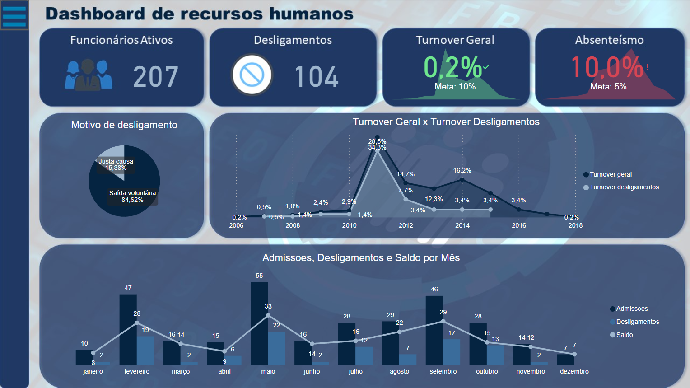
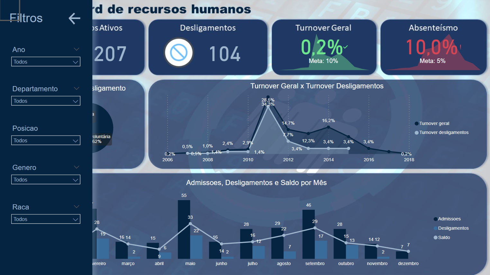
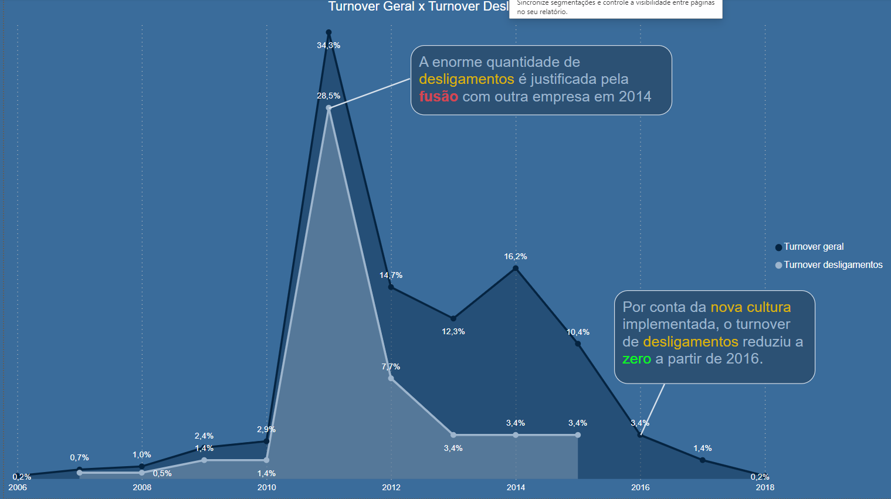

<h1 align="center"> Power BI: Explorando recursos visuais </h1>

##

  
Este curso aprofundou nas ferramentas de visualização disponíveis no Power BI: 

  <ul>
    <li>Recursos de acessibilidade</li>
    <li>P e R</li>
    <li>Criação de apresentações</li>
    <li>Uso de recursos que que facilitam o <i>storytelling</i></li>
  </ul>

  
Segue uma pré-visualização das funcionalidades disponíveis ao final do curso:

 ### Dashboard

  

### Menu do dashboard

  

### Exemplo de página de apresentação

  

  
