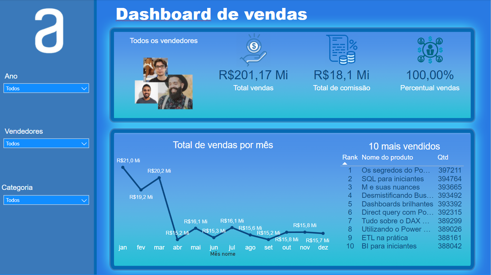

<h1 align="center"> Power BI: Fórmulas DAX </h1>

##

  
Este curso aprofundou nas principais fórmulas DAX utilizadas para a criação de medidas no Power BI: 

  <ul>
    <li>Funções lógicas</li>
    <li>Funções de filtro</li>
    <li>Funções de inteligência de dados temporais</li>
    <li>Funções informativas e de relação</li>
    <li>Funções matemáticas e estatísticas</li>
  </ul>

  
Também foram abordados os programas DAX Studio e Power BI Helper - que servem como auxiliares nos procedimentos de criação de fórmulas DAX e documentação de projetos.

  
Segue uma pré-visualização do dashboard desenvolvido ao final do curso:

  

  
