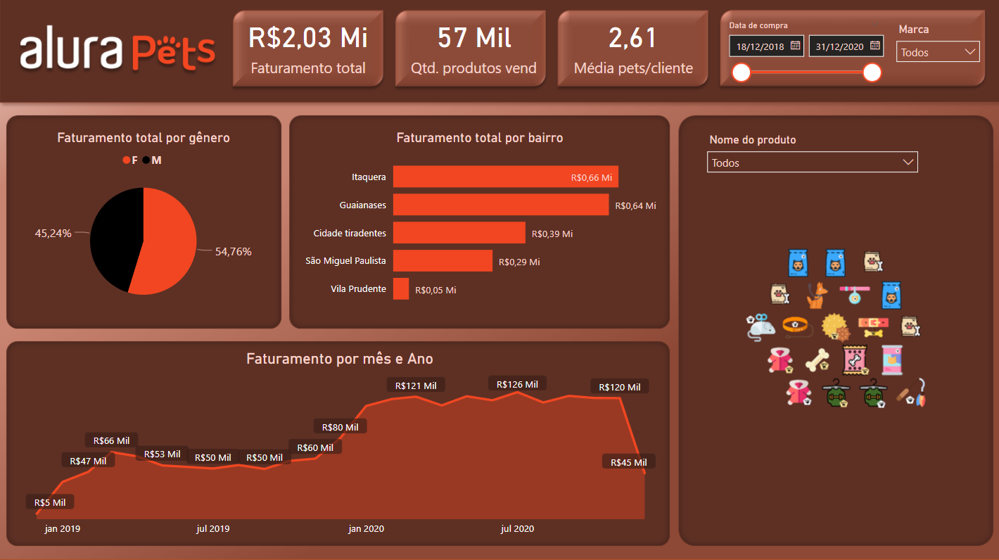

<h1 align="center"> Primeiro Dashboard </h1>

##

  
Neste curso foi realizada a introdução aos principais conceitos do Power BI: 

  <ul>
    <li>Importando arquivos</li>
    <li>Tratamento de dados</li>
    <li>Criação de medidas</li>
    <li>Criação de visualizações</li>
  </ul>

  
Segue uma pré-visualização do dashboard desenvolvido ao final do curso:

  
  
  
