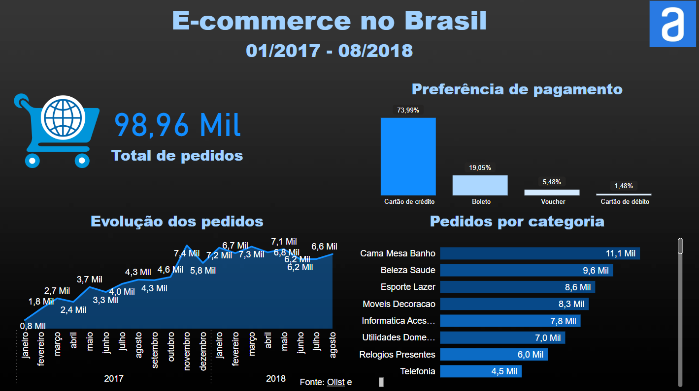

<h1 align="center"> Tratamento de dados no Power Query </h1>

##

  
Este curso aprofundou os princípios de tratamento de dados no Power Query: 

  <ul>
    <li>Tratamento de colunas</li>
    <li>Tipagem de dados</li>
    <li>Tratamento de valores nulos</li>
    <li>Mesclagem de consultas</li>
  </ul>

  
Segue uma pré-visualização do dashboard desenvolvido ao final do curso:

  

  
