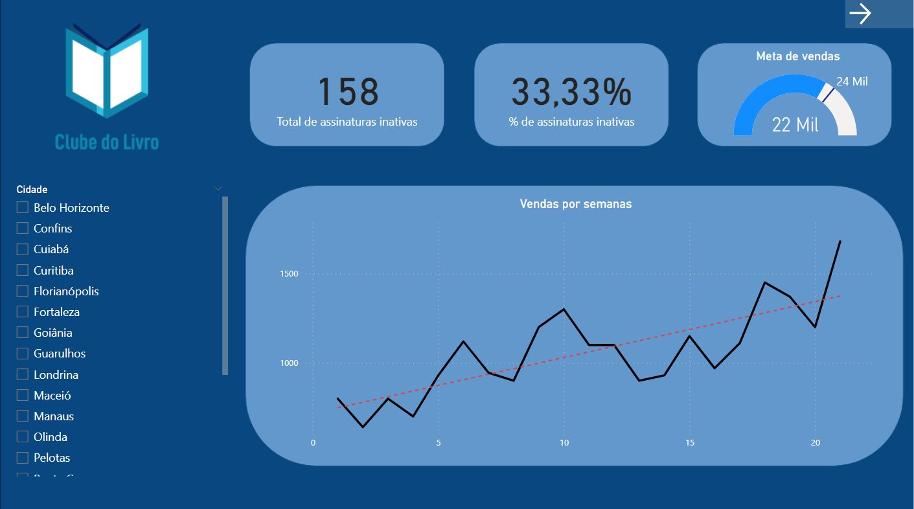
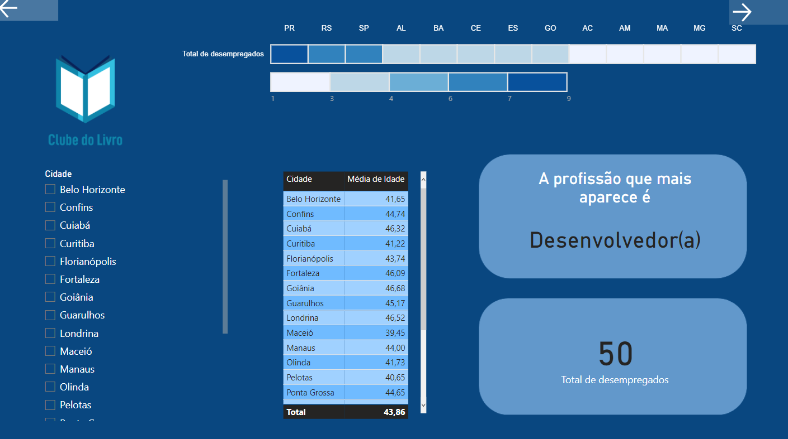
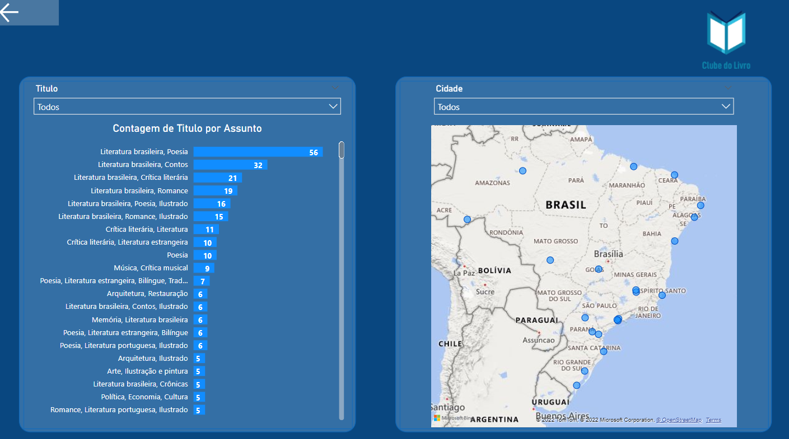

<h1 align="center"> Visualizando Dados </h1>

##

  
Este curso aprofundou os princípios de visualização de dados no Power BI, bem como ferramentas de segmentação de dados 

  
Também foram implementados botões, de forma a realizar a transição entre páginas do dashboard.
 

  
Segue uma pré-visualização do dashboard desenvolvido ao final do curso:

### Página 1:
  
  
### Página 2:
  

### Página 3:
  

  
